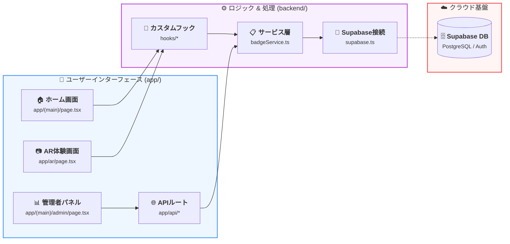

# 📖 Adventurer's Field Journal

### — ATD26_SCIENCE-ART —

> **「失われた標本たちを、君の瞳で呼び覚ませ。」**
>
> 実世界の絵画に隠された幻想的な3D標本をスキャンし、自分だけのフィールドジャーナルを完成させるAR絵画探索・標本収集アプリケーション。

---

## 🌟 エクスペリエンス (The Experience)

実世界の絵画（ターゲット）をスマートフォンでスキャンすることで、3D標本が目の前に現れます。全ての標本は時系列順にジャーナル（ホーム画面）へ記録され、全てを揃えることで「最終日誌」への道が開かれます。

---

## 🏗 システム構成図 (Architecture Diagram)

プロジェクト全体のデータの流れと構造を可視化しています。

> [!TIP]
> より詳細でリッチなアイコン版の図面は [docs/ARCHITECTURE_DIAGRAM.drawio](./docs/ARCHITECTURE_DIAGRAM.drawio) で閲覧・編集可能です。

---

## 📂 構成と役割 (Structure & Files)

### 🖼️ 画面・インターフェース (`app/`)

- `page.tsx`: **ホーム画面 (Journal Roadmap)**。標本の獲得状況を時系列で表示。
- **`ar/page.tsx`**: **AR探索画面**。MindARエンジンによる画像認識。
- **`release/page.tsx`**: **フォトモード**。獲得した標本を現実世界で撮影。
- **`api/`**: サーバーサイド実行による安全なデータ通信窓口。

### 🧠 知能・心臓部 (`backend/`)

- **`services/badgeService.ts`**: **データ統合レイヤー**。APIとDB操作を抽象化。
- **`lib/constants.ts`**: **標本の定義**。サイズ、動き、アニメーションを制御。
- **`lib/supabase.ts`**: データベースへの接続と匿名認証。

### 🧩 UI部品・ロジック (`components/`, `hooks/`)

- `BadgeCard.tsx`: ジャーナルに並ぶ「標本箱」のコンポーネント。
- `useAR.ts`: **ARライフサイクル**。認識、解析ゲージ、状態管理を一括制御。

---

## 🛠 技術スタック (Tech Stack)

- **Frontend**: `Next.js 16`, `React 19`, `Framer Motion`, `Tailwind CSS v4`
- **AR/3D**: `MindAR (Image Tracking)`, `A-Frame`, `THREE.js`
- **Backend**: `Supabase (PostgreSQL / Auth)`
- **Quality**: `TypeScript`, `Zod`, `Vitest`, `ESLint`

---

## 🚀 クイックスタート

1. **セットアップ**: `pnpm install`
2. **開発開始**: `pnpm dev`
3. **ビルド**: `pnpm run build`

---

© 2026 ATD26_SCIENCE-ART Project.
