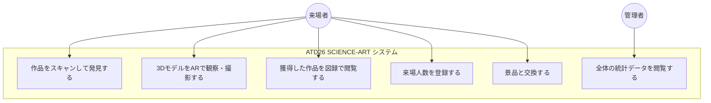
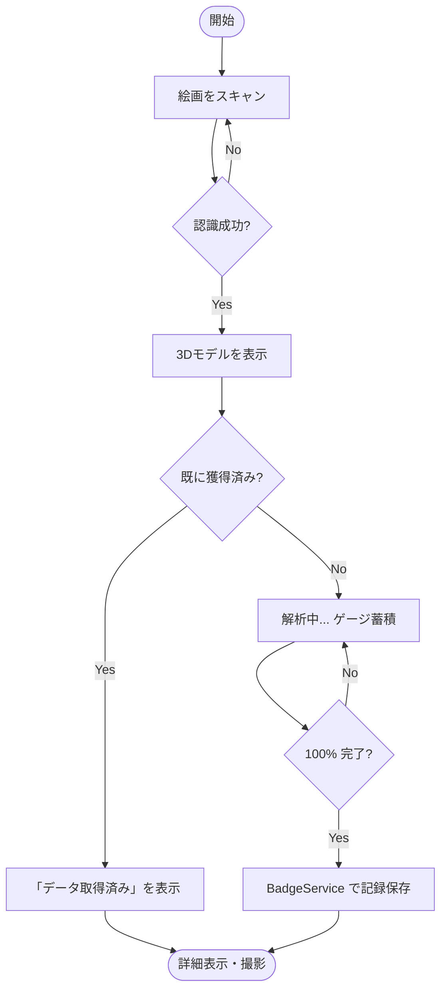

# APIおよびサービス仕様書

### システムの相互運用性とセキュリティ設計

本アプリケーションは、API レイヤーを介して高度なセキュリティ制御、データのバリデーション、およびトラフィック管理を実装しています。

---

## 1. システム全体図

### ユースケース (Use Case)

ユーザー（来場者）と管理者がシステムを通じてどのようなアクションを行うかを定義します。



### アクティビティフロー (Activity Flow)

主要な機能である「作品の発見から獲得まで」の論理フローです。



---

## 2. API一覧 (Endpoint Audit)

アプリケーション内で使用されているすべての API を分類してまとめます。

### 2.1 内部 API (Internal REST API)
Next.js の API Routes (`frontend/app/api/v1/`) で実装されているエンドポイントです。

| エンドポイント | メソッド | 説明 | 認証 | キャッシュ |
| :--- | :--- | :--- | :--- | :--- |
| `/api/v1/badges` | `GET` | 全標本データのマスターリスト取得 | 不要 | L3 (CDN) |
| `/api/v1/badges/acquire` | `POST` | 標本獲得の記録 | 要 (匿名) | なし |
| `/api/v1/badges/acquired` | `GET` | ユーザーごとの獲得済みリスト取得 | 要 (匿名) | L1 (SWR) |
| `/api/v1/profile/get` | `GET` | ユーザープロフィールの取得 | 要 (匿名) | L1 (SWR) |
| `/api/v1/profile/update` | `POST` | 来場人数や交換フラグの更新 | 要 (匿名) | なし |
| `/api/v1/admin/stats` | `GET` | 管理者用統計データ（集計値） | 要 (Admin) | L2 (Redis) |

### 2.2 外部サービス・システム API
直接またはライブラリを介して通信している外部連携です。

| サービス | 用途 | 備考 |
| :--- | :--- | :--- |
| **Supabase Auth** | 匿名サインイン、セッション管理 | `supabase.auth.*` |
| **Supabase Database** | PostgreSQL への直接クエリ（サーバーサイド） | `PostgREST` |
| **Upstash Redis** | 統計データ、レートリミット用キャッシュ | REST 経由 |
| **Web Share API** | 撮影画像の OS 標準共有機能 | ブラウザネイティブ API |
| **Vercel Edge/CDN** | プログラムや 3D モデルの高速配信 | インフラレベル (L3) |

---

## 3. キャッシュ戦略の定義

ドキュメント内で使用されているキャッシュの階層定義です。

- **L1 (Client Cache)**: ブラウザ上の SWR キャッシュ。画面遷移を高速化します。
- **L2 (Server Cache)**: Redis によるサーバーサイドキャッシュ。複雑な集計の負荷を下げます。
- **L3 (Edge Cache)**: CDN (Vercel) による静的ファイルのキャッシュ。地理的に近い場所から配信されます。

---

## 4. 共通レスポンス形式 (Standard Response)

全ての内部 API は一貫した JSON 構造を返します。

### ✅ 成功時 (Success: 200 OK)
```json
{
  "success": true,
  "data": { ... }
}
```

### ❌ 失敗時 (Failure: 4xx / 5xx)
```json
{
  "success": false,
  "error": {
    "code": "ERROR_CODE",
    "message": "ユーザー向けメッセージ"
  }
}
```
