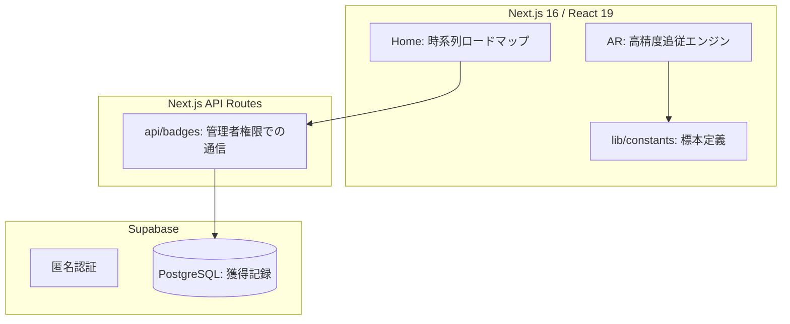

# 🏛️ Architecture & Technology Stack

## 1. アーキテクチャ概要

本プロジェクトは、AR体験と実データの整合性を重視した 3 レイヤー構造を採用しています。

## 2. 技術スタック

- **Frontend**: Next.js 16 (App Router), React 19, Framer Motion
- **AR Engine**: MindAR.js (画像認識), A-Frame (3D空間制御)
- **Backend**: Supabase (Auth / Database)
- **Logic**: TypeScript (型安全性の徹底)

## 3. 処理のライフサイクル

### 標本の「発見」から「記録」まで

1.  **認識**: `AR/page.tsx` が `targets.mind` に基づき絵画を特定。
2.  **解析**: `useAR.ts` が解析ゲージを走らせ、100% で獲得リクエストを送信。
3.  **保存**: `api/badges/acquire` が管理者権限で `user_badges` に日時（JST）と共に保存。
4.  **反映**: ホームに戻ると、`useHome.ts` が獲得日時順に標本を並べ替え、冒険の軌跡を更新。
