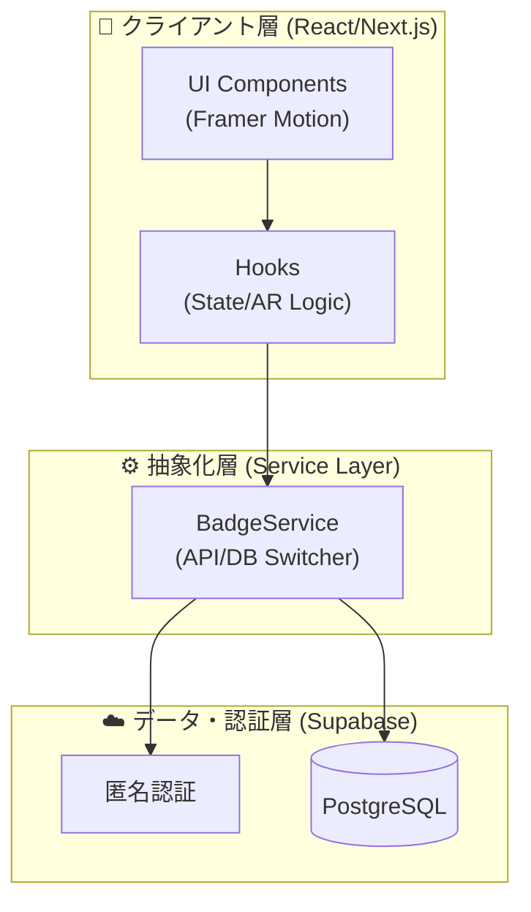

# 🏛️ Architecture & Technology Stack

### — 設計思想と技術構造 —

本プロジェクトは、AR体験の即時性と、永続データの正確性を両立させるための 3 レイヤー構造を採用しています。

---

## 1. アーキテクチャ概要 (Overview)

---

## 2. 処理のライフサイクル (Life Cycle)

標本の「発見」から「記録」までの流れ：

1.  **認識 (Recognition)**: `AR/page.tsx` が `targets.mind` を通じて物理的な絵画を検知。
2.  **解析 (Analysis)**: `useAR.ts` が 3.0秒間の「注視」を確認し、解析ゲージを進行。
3.  **保存 (Persistence)**: サーバーサイド API が管理者権限で `user_badges` テーブルへ書き込み。
4.  **反映 (Feedback)**: ホーム画面に戻った際、`useHome.ts` が最新データを取得し、発見順にジャーナルを再構築。

---

## 3. 選定技術の理由

- **Next.js 16 (App Router)**: 高速なページ遷移と、強力な API ルート機能のため。
- **MindAR.js**: 外部アプリ不要で、ウェブブラウザのみで高品質な画像追従を実現するため。
- **Supabase**: リアルタイムなデータ同期と、匿名認証による「ログイン不要の体験」を即座に構築するため。
- **Tailwind CSS v4**: 「手書きの質感」や「羊皮紙の背景」といったアナログなデザインを、宣言的に素早く実装するため。
