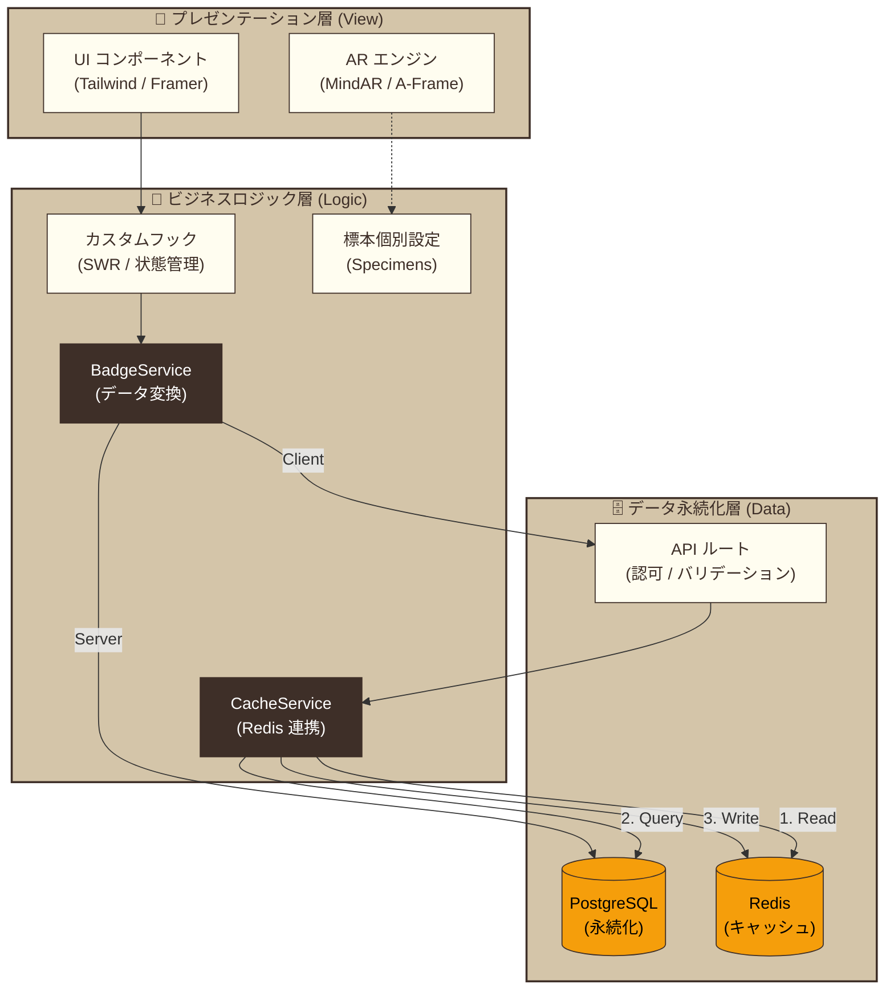

# アーキテクチャおよび技術設計

### 3層構造の設計と多層キャッシング

システムは、プレゼンテーションレイヤー、ビジネスロジックレイヤー、およびデータ永続化レイヤーの間で明確な関心の分離 (SoC) を実現し、高負荷に耐えうるキャッシング戦略を採用している。

---

## 1. システムアーキテクチャ

システムは、プレゼンテーションレイヤー、ビジネスロジックレイヤー、およびデータ永続化レイヤーの間で明確な関心の分離 (SoC) を実現している。

```mermaid
graph TD
    %% レイヤー定義
    subgraph Presentation ["🎨 プレゼンテーション層 (View)"]
        UI["UI コンポーネント<br/>(Tailwind / Framer)"]
        AR["AR エンジン<br/>(MindAR / A-Frame)"]
    end

    subgraph Logic ["🧠 ビジネスロジック層 (Logic)"]
        Hooks["カスタムフック<br/>(SWR / 状態管理)"]
        BS["BadgeService<br/>(データ変換)"]
        CS["CacheService<br/>(Redis 連携)"]
        Spec["標本個別設定<br/>(Specimens)"]
    end

    subgraph Data ["🗄️ データ永続化層 (Data)"]
        API["API ルート<br/>(認可 / バリデーション)"]
        DB[("PostgreSQL<br/>(永続化)")]
        Cache[("Redis<br/>(キャッシュ)")]
    end

    %% 通信フロー
    UI --> Hooks
    Hooks --> BS
    BS -- Client --> API
    API --> CS
    CS -- 1. Read --> Cache
    CS -- 2. Query --> DB
    CS -- 3. Write --> Cache
    BS -- Server --> DB
    AR -.-> Spec

    %% スタイル定義
    classDef layer fill:#d4c5a9,stroke:#3e2f28,stroke-width:2px,color:#3e2f28
    classDef node fill:#fffdf0,stroke:#3e2f28,color:#3e2f28
    classDef service fill:#3e2f28,stroke:#3e2f28,color:#fff
    classDef database fill:#f59e0b,stroke:#3e2f28,color:#000

    class Presentation,Logic,Data layer
    class UI,AR,Hooks,Spec,API node
    class BS,CS service
    class DB,Cache database
```

---

## 2. 通信プロトコルの選定理由

- **REST (HTTP/2)**: 主要なリソース操作（標本データの取得、プロフィール更新等）に使用する。
- **SSE / WebSockets**: Supabase Realtime を介したデータベース変更のリアルタイム Push に使用する。

---

## 3. レンダリングおよびキャッシング戦略

### レンダリング手法

- **Server-Side Rendering (SSR)**: 初期表示速度の向上と SEO 対応のため、サーバーコンポーネントで初期データを取得する。
- **Client-Side Rendering (CSR)**: AR エンジンの制御や、SWR による動的なデータ更新に使用する。

### 多層キャッシング (Multi-layer Caching)

1.  **L1: クライアントキャッシュ (SWR)**: `stale-while-revalidate` 戦略により、画面遷移時に以前のデータを瞬時に表示する。バックグラウンドで最新化を行うことで、読み込み待機時間を実質ゼロにしている。
2.  **L2: API レスポンスキャッシュ (Redis)**: 重い集計クエリ（管理者統計等）の結果を Redis に保存し、DB 負荷を軽減する。
3.  **L3: セルフホスト・アセット**: ARエンジン（MindAR, A-Frame）やデコーダー等の外部ライブラリを `public/scripts/` でホストする。CDN 障害の影響を排除し、オフラインに近い安定性を確保している。また、3D モデルはブラウザキャッシュを有効化し、2回目以降のロードを高速化している。

---

## 4. 各レイヤーの責務

### 📂 プレゼンテーションレイヤー (View)

- **ハイブリッド描画**: AR カメラ画面（`/ar`）では動的な 3D レンダリングを行い、詳細ビューワー（`/viewer`）では高品質な 2D 画像を表示する、体験と実用性を両立した構成である。
- **高品質レンダリング**: アンチエイリアス有効化、計算精度の向上 (`highp`)、およびスムージングフィルタにより、ジッター（微小振動）を抑えた滑らかな AR 体験を提供する。
- **状態の即時反映**: パーティ人数入力時など、通信待ちの間に UI が再描画（フリッカー）しないよう、ローカル状態による先行的な UI制御を実装している。
- **ネイティブ連携**: Web Share API を活用し、撮影画像の「写真」アプリへの保存を容易化している。
- **インタラクティブUI**: 景品交換チケット（FinalLogModal）における 2 段階確認フローを実装している。

### 📂 ビジネスロジック層 (Logic)

- データの取得戦略（キャッシュ優先か DB 優先か）を決定する。
- **BadgeService**: 実行環境に応じた最適な通信経路を選択する。
- **CacheService**: Redis への GET/SET 操作を抽象化する。
- **標本詳細設定 (Specimens)**: `backend/lib/specimens/` 下に各 3D モデル固有のパラメータ（スケール、アニメーション、表示ロジック）を個別のファイルとして分離している。

### 📂 データ・インフラ層 (Data)

- **API ルート**: セキュリティ、バリデーション、およびキャッシュ制御を強制する。
- **PostgreSQL**: 永続的なデータの「真実のソース（Source of Truth）」である。
- **Redis (Upstash)**: 一時的な高速アクセスのためのデータストアである。

---

## 5. 運用コストとスケーラビリティ

本システムは、Vercel の無料枠（Hobby Plan）内でも安定して運用できるよう設計されている。

### Vercel 無料枠への適合性

1.  **静的アセットの最適化**: 3D モデル (.glb) などの重いファイルは、Next.js のビルドプロセスを通じて CDN (Vercel Edge Network) で配信される。100GB/月の帯域幅は、小〜中規模のプロトタイプには十分な容量である。
2.  **サーバーレス関数の負荷軽減**: 複雑な集計処理を Redis (Upstash) にキャッシュし、フロントエンドでは SWR を活用することで、API リクエスト数と実行時間を最小限に抑えている。
3.  **BaaS の活用**: データベースと認証には Supabase の無料枠を利用しており、Vercel 側のリソース（特に DB 接続数）を圧迫しない。

### 将来の拡張性

- ユーザー数が増加した場合は、Vercel Pro Plan への移行や、Supabase のリソース増強のみで対応可能なステートレスな設計となっている。

---

## 6. デザイン哲学と世界観

本プロジェクトは「冒険者のフィールドジャーナル」という一貫したコンセプトの下、デザインと実装が行われている。

### 世界観の構成要素

- **アナログな質感**: UI コンポーネントには、古びた紙や革の質感を連想させる配色と影の演出を施している。
- **気品あるタイポグラフィ**: 読みやすさと共に、探検記のような風格を感じさせるフォント選定とカーニングを採用している。
- **情緒的なアニメーション**: Framer Motion を活用し、ページ遷移や標本の出現時に「発見の喜び」を感じさせる、滑らかで重みのある動きを実装している。
- **没入感の追求**: AR 体験中も、単なるデジタルデータの表示ではなく、現実世界に「古の標本が顕現した」かのような演出（Specimens 設定による補正）を重視している。

---

## 7. 技術的根拠のまとめ

| 技術                | 妥当性                                                                     |
| :------------------ | :------------------------------------------------------------------------- |
| **Next.js 16**      | SSR、APIルート、および外部パッケージトランスパイルの統合環境として。       |
| **Redis (Upstash)** | サーバーレス環境でのステートレスな高速キャッシングを実現するため。         |
| **Zod**             | TypeScript の型定義と実行時のバリデーションを一致させ、安全な通信を担保。  |
| **Supabase**        | PostgreSQL と認証機能を低コストで迅速に構築するため。                      |
| **SWR**             | クライアントサイドでの高度なデータ再検証とキャッシュ管理を容易にするため。 |
| **pnpm workspaces** | フロントエンドとバックエンドの物理的分離（モノレポ）を実現するため。       |
