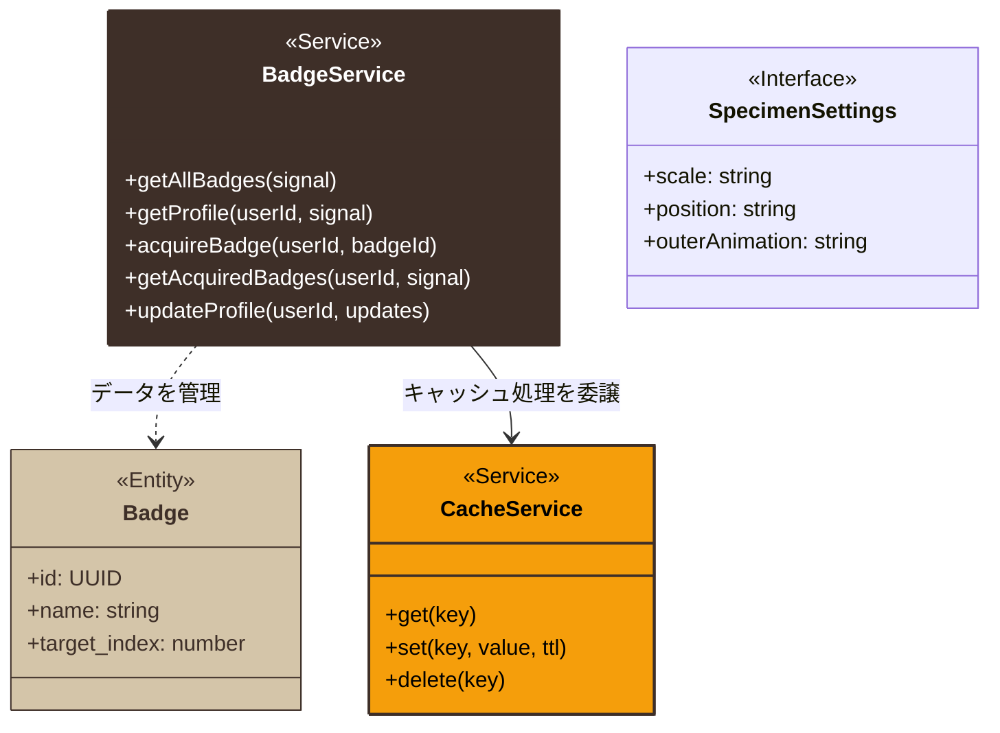
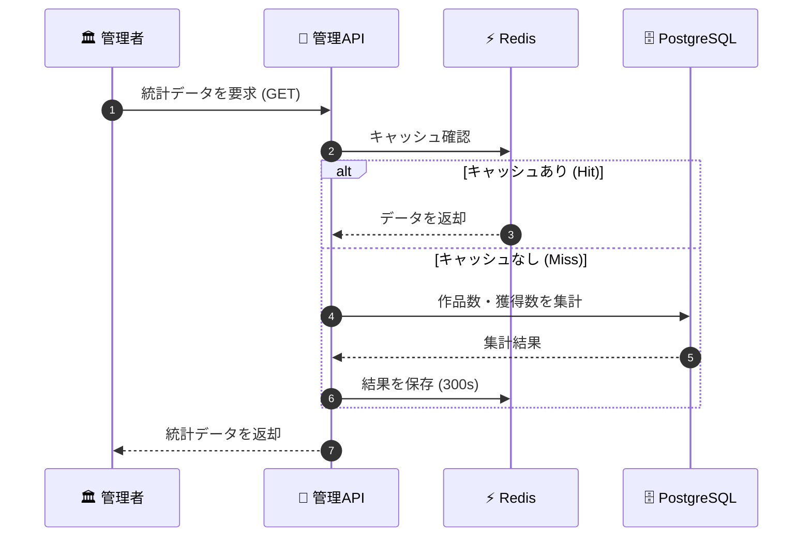
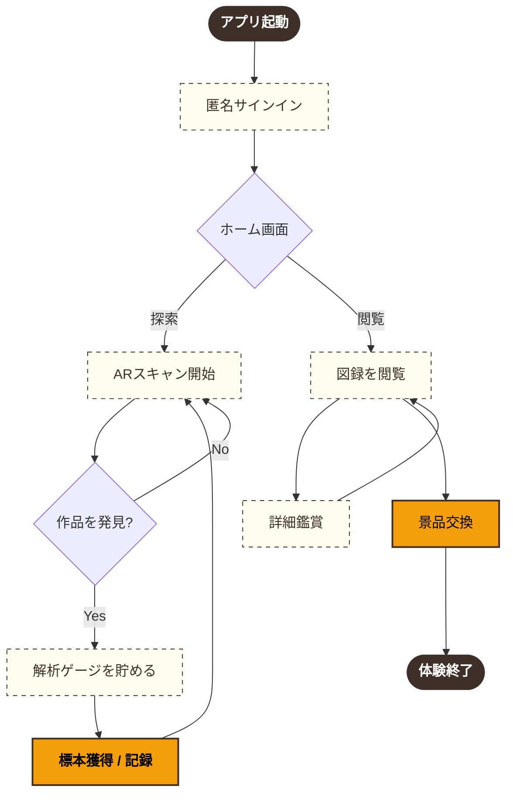
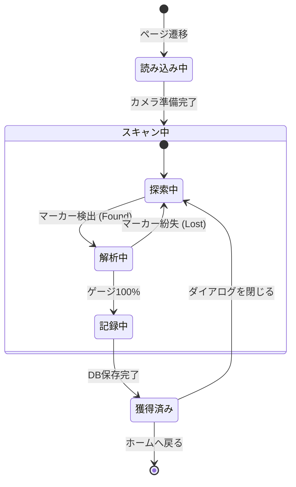
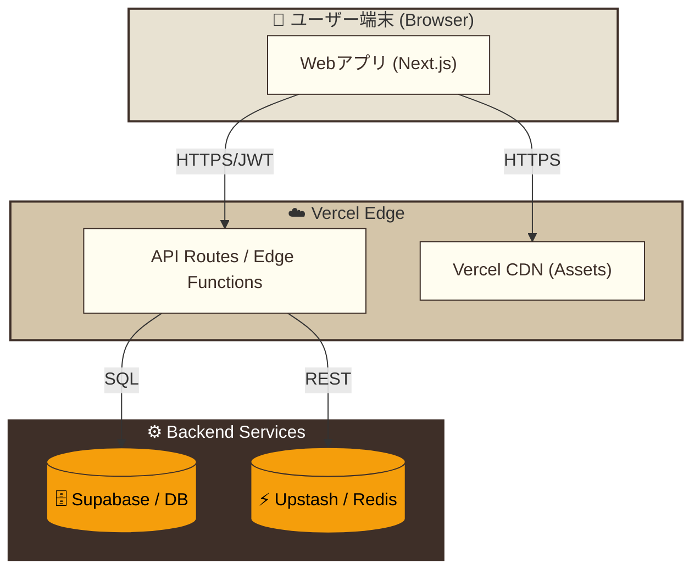

# 📊 システム図面集 (System Diagrams)

本ドキュメントでは、アプリケーションの構造、振る舞い、および配置を多角的に解説する。

---

## 1. クラス図 (Class Diagram)

システムの静的な構造と、主要なサービスクラス間の関係を示す。

---

## 2. シーケンス図 (Sequence Diagram)

管理者ダッシュボードの統計表示における、キャッシュ（Redis）の活用フローである。

---

## 3. アクティビティ図 (Activity Diagram)

ユーザーが体験する「発見と記録」のメインループである。

---

## 4. ステートマシン図 (State Machine Diagram)

`/ar` ページ内における AR エンジンの内部状態遷移である。

---

## 5. 配置図 (Deployment Diagram)

システムを支えるクラウドインフラとプロトコルの全体構成である。

