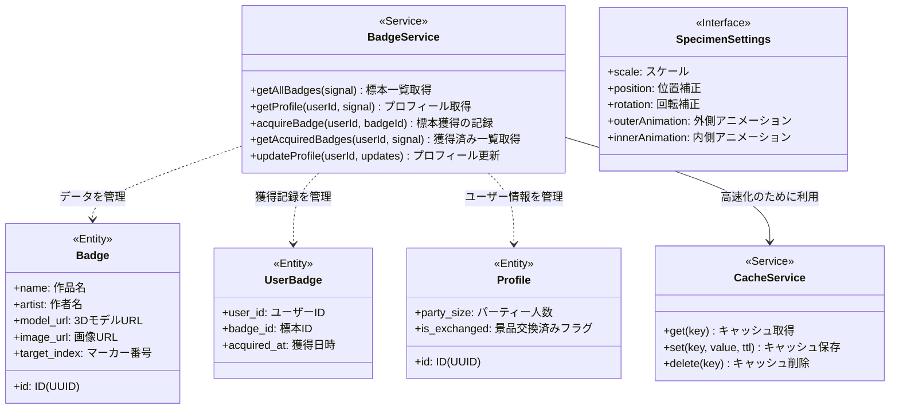
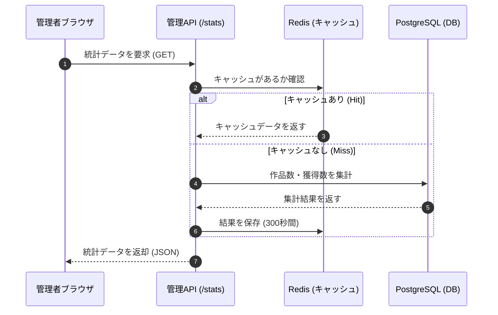
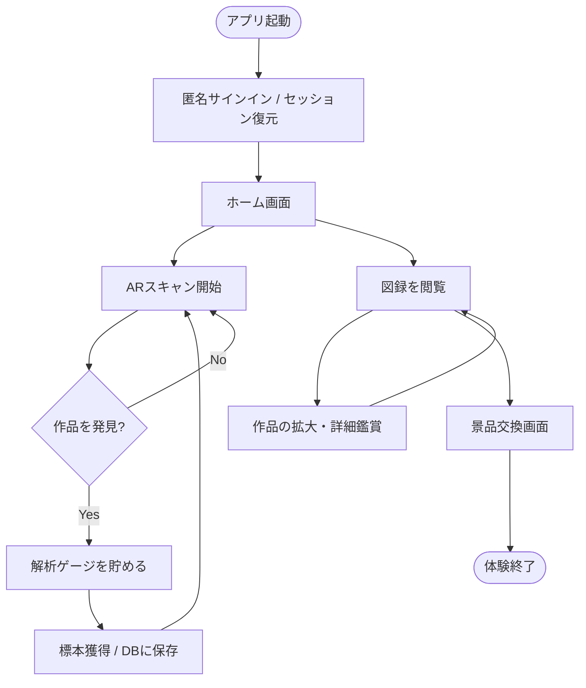
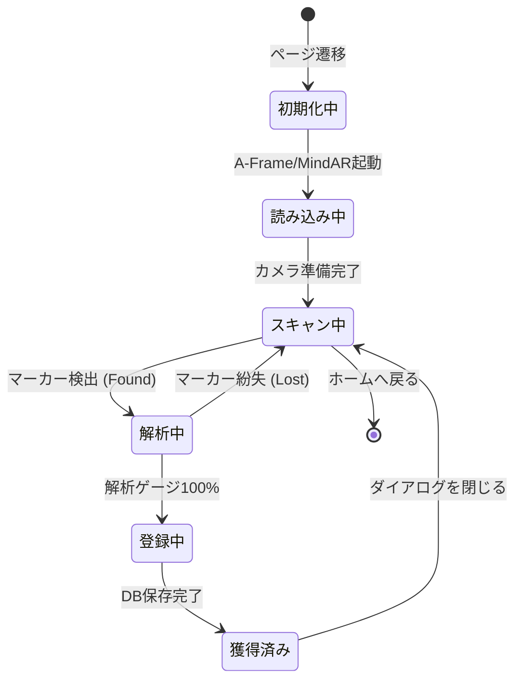
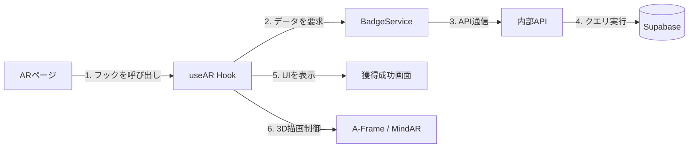
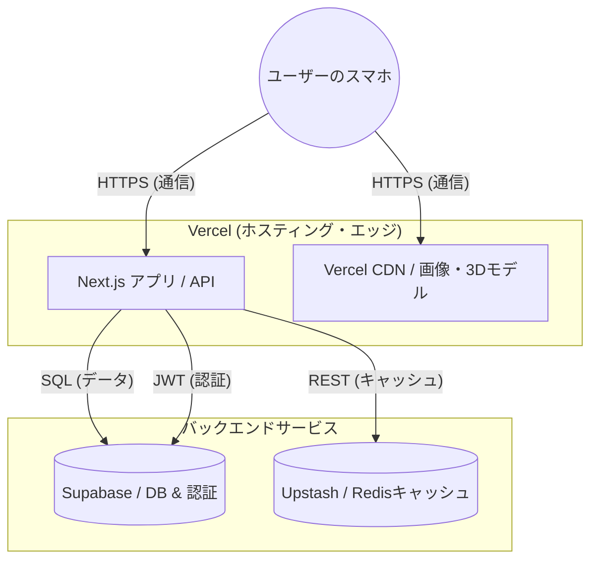
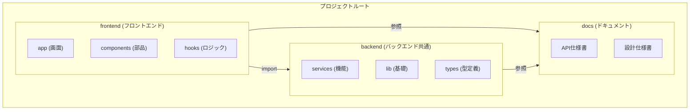
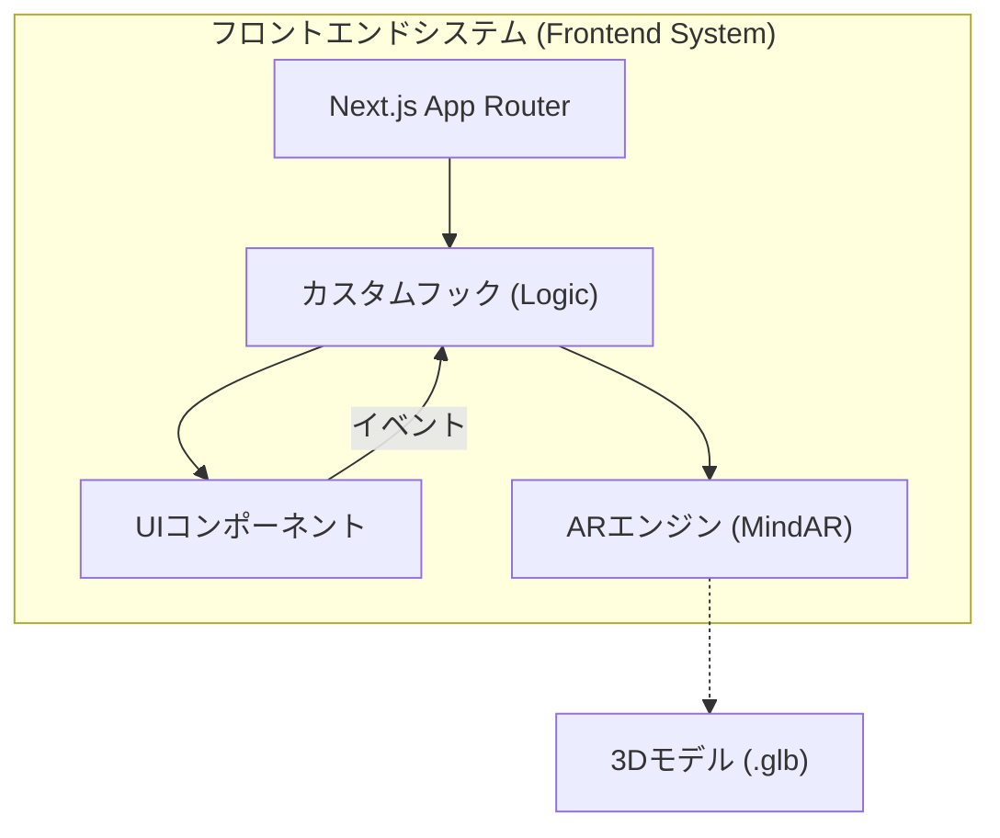
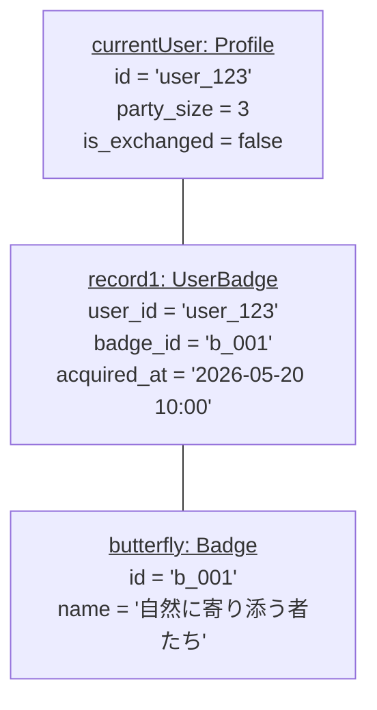

# 📊 システム図面集 (System Diagrams)

本ドキュメントでは、アプリケーションの構造、振る舞い、および配置を UML および各種図面を用いて多角的に解説します。エンジニアがシステムの全体像を把握し、新しい機能の追加や修正を行う際の指針となります。

---

## 1. クラス図 (Class Diagram)

システムの「静的な構造」を表します。主要なサービスクラスと、データベースとやり取りされるデータの型（エンティティ）の関係を定義しています。

**解説:** `BadgeService` はビジネスロジックの中心であり、`CacheService`（Redis連携）を利用しながら `Badge`（作品）や `Profile`（ユーザー情報）を管理します。

---

## 2. シーケンス図 (Sequence Diagram)

「時間の経過」に沿ったオブジェクト間のやり取りを表します。

**解説:** 管理者ダッシュボードの統計表示における、キャッシュ（Redis）の活用フローです。一度 DB で集計した結果を Redis に保存（SET）し、次回以降は DB に負荷をかけずに高速に返却（GET）する仕組みを可視化しています。

---

## 3. アクティビティ図 (Activity Diagram)

ユーザーが体験する「一連の業務フロー」を表します。

**解説:** アプリを起動してから、ARで作品を見つけ、図録を完成させ、最後に景品と交換するまでのメインループです。

---

## 4. ステートマシン図 (State Machine Diagram)

特定の画面やオブジェクトの「状態の変化」を表します。

**解説:** `/ar` ページ内における AR エンジンの内部状態です。カメラの起動から、マーカーを見つけて解析が完了するまでの条件分岐を定義しています。

---

## 5. コミュニケーション図 (Communication Diagram)

オブジェクト間の「関係性とメッセージ」に注目した図です。

**解説:** フロントエンドの各モジュールが、どのような順番で連携してデータを取得・表示しているかを示します。

---

## 6. 配置図 (Deployment Diagram)

システムが「どのハードウェア/クラウド」で動作しているかを表します。

**解説:** Vercel によるホスティングと、バックエンドの BaaS (Supabase, Upstash) の連携、および通信プロトコル（HTTPS/JWT）の全体構成です。

---

## 7. パッケージ図 (Package Diagram)

システムの「ディレクトリ構造と依存関係」を表します。

**解説:** モノレポ構造を採用しており、`frontend` が `backend` の共通ロジックを参照し、双方が `docs` の仕様書を参照する関係を示します。

---

## 8. コンポーネント図 (Component Diagram)

システムの「機能ブロック」とそのインターフェースを表します。

**解説:** フロントエンド内部の主要な構成要素をグループ化したものです。`LogicHooks` がオーケストレーターとして機能し、UI と AR エンジンを制御します。

---

## 9. オブジェクト図 (Object Diagram)

ある時点での「具体的なデータの状態」を表します。

**解説:** ID `user_123` のユーザーが「自然に寄り添う者たち」を 獲得した瞬間の、メモリ上のデータ構造を例示したものです。

