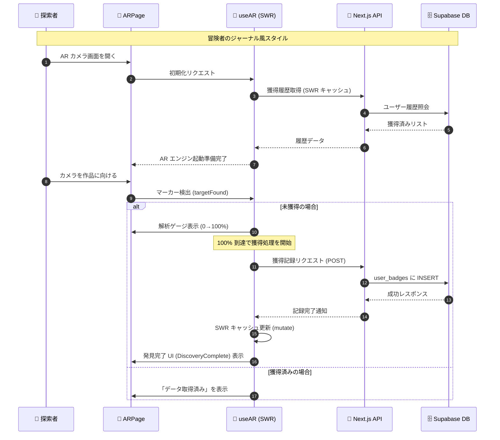

# 🎨 絵画コレクション設定仕様書

本ドキュメントでは、AR空間および詳細ビューワーにおける絵画作品の表示設定について解説する。

---

## 1. コンセプト：体験と実用のハイブリッド

本アプリケーションは、AR による「驚き」と、図録による「詳細な鑑賞」を両立させている。

### 🔍 AR スキャン画面 (`/ar`)

- **目的**: 現実空間への作品の顕現。
- **挙動**: 各作品に紐付いた **3D モデル (.glb)** が出現する。生物やアーティファクトが立体的に動き、発見の喜びを演出する。

### 🖼 詳細ビューワー (`/viewer`)

- **目的**: 作品の細部までの鑑賞。
- **挙動**: 3D モデルではなく、**実際の高解像度絵画画像 (2D)** を豪華な額縁演出で表示する。これにより、モバイル環境でもストレスなく、作品本来の魅力を伝えることが可能である。

---

## 2. 設定の管理構造

標本の設定は、`backend/lib/specimens/` ディレクトリ内で標本ごとに独立したファイルとして管理されている。

- **`types.ts`**: 設定項目のインターフェース定義である。
- **`index.ts`**: 全標本設定の集約と提供を担う。
- **`[標本名].ts`**: 個別の 3D パラメータ定義を記述する。

---

## 3. 設定パラメータの定義

`SpecimenSettings` インターフェースで定義されている主要な項目は以下の通りである。

| パラメータ              | 役割               | 説明                                                          |
| :---------------------- | :----------------- | :------------------------------------------------------------ |
| `scale`                 | 標準スケール       | AR マーカー上で表示される際の基準サイズ。                     |
| `position`              | 位置補正           | モデルの重心補正用（例: `"0 0.5 0"`）。                       |
| `rotation`              | 回転補正           | モデルの初期向きの補正用（例: `"0 90 0"`）。                  |
| `outerAnimation`        | 外側アニメーション | モデル全体に対する動き（移動・回転）。                        |
| `innerAnimation`        | 内側アニメーション | 浮遊感や伸縮など、モデル固有の微細な動き。                    |
| `animationMixer`        | 内部アニメ制御     | GLB 内のボーンアニメーション等の有効化（`animation-mixer`）。 |
| `minScale` / `maxScale` | オートスケール範囲 | カメラとの距離に応じた自動リサイズの限界値。                  |

---

## 4. 標本別設定のポイント

現在の主要な作品設定の設計方針である。全ての作品は、AR マーカー（絵画）から飛び出す「圧倒的な存在感」を演出するため、適切なスケールとアニメーションが設定されている。

- **お母さんの初水族館 (Leviathan)**:
  - **動き**: 従来の回転を廃止し、横方向にゆったりと往復する「水平遊泳」を実装。
  - **演出**: 進行方向にあわせてわずかに頭を傾けるヨーイング（傾斜）を加え、生物らしい質量感を表現。
- **自然に寄り添う者たち (Common Blue)**:
  - **動き**: 有機的なゆらぎ（回転の揺れ）と、画面の手前へ迫る前後運動を設定。
  - **内部アニメ**: `animation-mixer` により、3D モデル固有の羽ばたきモーションを同期再生。
- **ちょっと不思議な海の冒険 (Shellcrab)**: 正面向きで静止しつつ、微細な浮遊感を持たせている。
- **海底の奥 (Antique Sword)**: 静かに回転しつつ、上下にゆっくりと浮遊する。
- **よすが (Great Wave)**: 初期状態で斜めを向き、激しいうねりを表現。
- **遊々海月 (Moon Jelly)**: 大きく回転しながら、上下・前後・左右に広範囲に漂う幻想的な動き。

---

## 5. AR 体験の内部フロー (Sequence Diagram)

AR 画面を開いてから作品を発見し、データベースに保存されるまでの詳細な流れである。

---

## 6. 3D モデルの最適化指針

モバイル AR における快適な体験と帯域幅の節約のため、以下の最適化を推奨する。

- **圧縮技術**: Draco または Meshopt を使用してジオメトリを圧縮し、ファイルサイズを削減。
- **テクスチャ**: モバイルデバイス向けに 1024x1024 以下に制限。
- **ポリゴン数**: 1 モデルあたり 50,000 ポリゴン以内を目安とする。
- **目標サイズ**: 初期ロード時間短縮のため、1 モデル 5MB 程度を目標とする。

## 7. 新しい標本の追加手順

1.  `backend/lib/specimens/` に新しい `.ts` ファイルを作成する。
2.  `types.ts` の `SpecimenSettings` に準拠したオブジェクトを定義する。
3.  `index.ts` でインポートし、`SPECIMEN_SETTINGS` マップに登録する。
