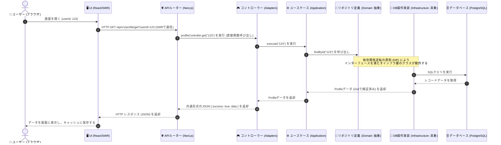

# システム全体のアーキテクチャとデータフロー図解

本ドキュメントは，本システムにおけるフロントエンド（Next.js）とバックエンド（クリーンアーキテクチャ）の結合構造，およびデータがどのように流れて処理されるかをわかりやすく解説するものである．

---

## 1. システムを構成する5つの階層と役割

システムは，内側に行くほど「ビジネスの本質（業務ルール）」に近く，外側に行くほど「具体的な技術（Webフレームワークやデータベース）」に依存する構造になっている．

| 階層                           | 役割                                                                           | 主なコードの配置場所                                                            |
| :----------------------------- | :----------------------------------------------------------------------------- | :------------------------------------------------------------------------------ |
| **① UI・プレゼンテーション層** | ユーザーへ画面を表示し，ボタン押下などの操作を受け付ける．                     | `frontend/components/` `frontend/app/`                                      |
| **② アダプター・BFF層**        | Webリクエスト（HTTPなど）と，システムのコアロジックを仲介する．                | `frontend/app/api/v1/` `backend/src/adapters/controllers/`                  |
| **③ アプリケーション層**       | 「プロフィールの取得」など，具体的な機能（ユースケース）の処理手順を記述する． | `backend/src/application/use-cases/`                                            |
| **④ ドメイン層 (核心部)**      | 業務のデータ構造やビジネスルールを定義する．他のどのレイヤーにも依存しない．   | `backend/src/domain/entities/` `backend/src/domain/repositories/`           |
| **⑤ インフラストラクチャ層**   | データベース操作の実体や，外部サービス（Redis，Supabase）との通信をおこなう．  | `backend/src/infrastructure/repositories/` `backend/src/infrastructure/db/` |

---

## 2. 依存関係のルール（一方通行の原則）

- **「外側から内側」へ一方通行で依存する**：
  内側のレイヤー（ドメイン層やアプリケーション層）は，外側にあるデータベースやWebフレームワークの種類を一切知らない．
- **依存関係逆転の原則 (DIP)**：
  アプリケーション層（ユースケース）は，インフラ層のデータベース処理を直接呼び出さない．ドメイン層に「リポジトリ・インターフェース」というデータの出入り口（窓口）だけを定義しておき，実際のデータベース処理は，インフラ層がその窓口の規格に合わせて後から実装を差し込む構造になっている．
  これにより，将来的にデータベースを差し替えても，ビジネスロジックは一切書き換える必要がない．

---

## 3. データフロー（リクエストからレスポンスまでの流れ）

ユーザーが画面を開いて「自分のプロフィールを取得する」際のデータの流れは以下の通りである．

この一方通行のデータフローと階層分けにより，それぞれの部品が「画面の表示」「通信の仲介」「処理手順の実行」「データ操作」に完全に独立し，変更に強くテストがしやすいシステムが構築されている．
