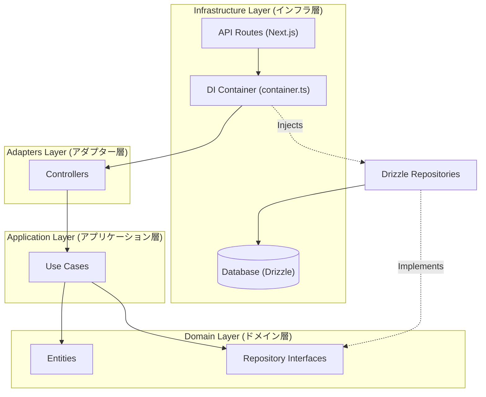
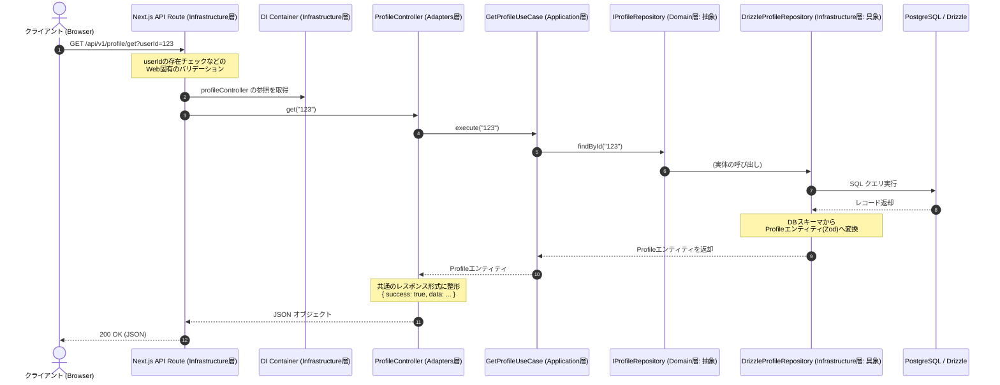

# バックエンド クリーンアーキテクチャ ガイド

本書は，本プロジェクト（`backend`）における**クリーンアーキテクチャ**の設計思想，各レイヤーの役割，データの流れ，および具体的な実装例について説明する．

---

## 1. クリーンアーキテクチャの全体像と依存の方向

クリーンアーキテクチャの最も重要なルールは **「依存の方向は常に外側から内側へ向かう」** という点である．

- **内側のレイヤー**（Domain, Application）は，外側のレイヤー（Adapters, Infrastructure, 外部フレームワークなど）について何も知らない．
- **外側のレイヤー**が変更（データベースやWebフレームワークの変更など）されても，内側のビジネスロジックは一切影響を受けない．

### 依存関係の構造

---

## 2. 各レイヤーの役割と記述内容

プロジェクトのディレクトリ構成に沿って，各レイヤーの役割と具体的なコードの記述内容を解説する．

### ① Domain（ドメイン）レイヤー

- **ディレクトリ**: `domain`
- **役割**: ビジネスの「本質的なルール」や「データ構造」を定義する，システムのコアとなるレイヤーである．他のどのレイヤーにも依存しない．
- **記述するもの**:
  - **Entities (`domain/entities`)**: ビジネスオブジェクトの構造と，データ構造そのものに対するバリデーション．本プロジェクトでは **Zod** を使用して定義されている．
    - _例_: `Profile.ts`
  - **Repository Interfaces (`domain/repositories`)**: データの永続化（保存や取得）を行うためのインターフェース定義．「どのような手段で保存するか」は定義せず，「どのようなデータ操作が必要か」のみを定義する．
    - _例_: `IProfileRepository.ts`
  - **Services / Logic**: 複数のエンティティをまたぐビジネスロジックや，ドメイン特有 of 計算処理など．

### ② Application（アプリケーション）レイヤー

- **ディレクトリ**: `application`
- **役割**: 「ユースケース（＝システムの利用シナリオ）」を実現するレイヤーである．ドメインオブジェクトを操作して，特定の処理手順（ワークフロー）を実行する．
- **記述するもの**:
  - **Use Cases (`application/use-cases`)**: 単一のタスクを実行するクラス．ドメインリポジトリのインターフェースに依存し，具象クラス（データベースへの実際の接続コードなど）には依存しない（**依存関係逆転の原則: DIP**）．
    - _例_: `GetProfileUseCase.ts`

### ③ Adapters（アダプター）レイヤー

- **ディレクトリ**: `adapters`
- **役割**: 外部世界（Webリクエストなど）とアプリケーション層の仲介を行うレイヤーである．
- **記述するもの**:
  - **Controllers (`adapters/controllers`)**: HTTPリクエストなどのパラメータを受け取り，ユースケースを呼び出し，結果をレスポンス用オブジェクトに変換して返す．Webフレームワーク（Next.jsやExpress等）に直接依存しないように，純粋なオブジェクトを入力・出力とするのが特徴である．
    - _例_: `ProfileController.ts`

### ④ Infrastructure（インフラストラクチャ）レイヤー

- **ディレクトリ**: `infrastructure`
- **役割**: データベース，Webサーバー，DIツールなどの「具体的な技術要素」が集まるレイヤーである．
- **記述するもの**:
  - **DB Configuration (`infrastructure/db`)**: Drizzle ORM や PostgreSQL の接続設定，スキーマ定義．
  - **Repositories Implementation (`infrastructure/repositories`)**: ドメイン層で定義したリポジトリインターフェース（`IProfileRepository` など）の具象実装クラスである．ここで SQL の発行や ORM の操作を行う．
    - _例_: `DrizzleProfileRepository.ts`
  - **Dependency Injection (`infrastructure/di`)**: クラス間の依存関係を解消し，インスタンス化して組み立てる場所（`container.ts` で手動DIを実行し，コントローラーをエクスポートする）．
  - **Services / External**: Redisキャッシュや Supabase クライアントなど，外部サービスに依存した具体的な実装．

---

## 3. 具体的な処理フロー（データの流れ）

ユーザーがプロフィール情報を取得するリクエスト `GET /api/v1/profile/get?userId=123` を送信した際の，制御の実行順序とデータフローは以下の通りである．

---

## 4. このアーキテクチャのメリット

1. **テストが容易になる (Testability)**
   - ビジネスロジック（`UseCase`）をテストする際，実際のデータベースを起動する必要はない．リポジトリをモック化することで，インメモリで高速かつ安定したユニットテストが行える．
2. **データベースや外部ライブラリの変更に強い (Maintainability)**
   - もし将来的にデータベースやORMを変更することになっても，変更が必要なのはインフラ層のリポジトリ実装と DB 設定ファイルのみである．ドメイン層やユースケースのロジックを書き換える必要は一切ない．
3. **ビジネスルールが技術的詳細に汚染されない (Readability)**
   - ドメイン層のコードを見るだけで，「このシステムがどのような仕様で動いているか」を把握できる．SQLクエリやHTTPヘッダーの処理といったノイズが混ざらない．
