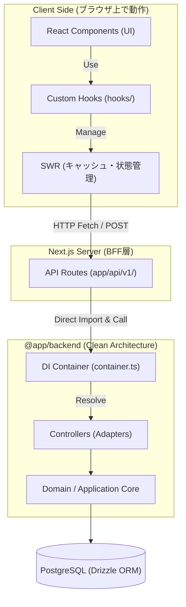

# フロントエンド アーキテクチャと通信ガイド

本書は，本プロジェクト（`frontend`）におけるフロントエンドのアーキテクチャ構成，およびバックエンド（`backend`）とどのように通信してシステムが構築されているかについて説明する．

---

## 1. フロントエンドアーキテクチャの全体像

本システムは **Next.js (App Router)** をベースとしたモノレポ構成を採用している．フロントエンドは，ユーザーインターフェース（UI）の描画をおこなうクライアントサイドと，バックエンドロジックと直接接続するAPIルート（BFF層）の両方を内包している．

### アーキテクチャの階層とデータフロー

---

## 2. 各構成要素の役割

### ① Page / Layout (`app/`)

画面のルーティングとレイアウト構造を定義する．基本的には，UIコンポーネントを配置し，状態管理のためのカスタムフックを呼び出す枠組みとして機能する．

### ② Components (`components/`)

ボタン，フォーム，カード，モーダルなどのUI部品を格納する．このレイヤーはビジネスロジックやデータフェッチの詳細を知らず，props経由でデータやイベントハンドラーを受け取って描画に専念する．

### ③ Custom Hooks (`hooks/`)

フロントエンドにおけるビジネスロジックの核となるレイヤーである．データの取得状況（Loading，Error），取得したデータ本体，更新処理などの「データライフサイクル」を管理し，UIコンポーネントからこれらの複雑なロジックを隠蔽する．

- _例_: `useProfile.ts` や `useBadges.ts`

### ④ BFF / API Routes (`app/api/v1/`)

Next.jsのAPIルーティング機能を利用した中継サーバー層である．
クライアント（ブラウザ）からのリクエストを受け付けるHTTPエンドポイントを提供する．

---

## 3. バックエンドとの通信メカニズム

本システムの通信において最も特徴的な点は，**「同一モノレポ内のバックエンドロジックを直接インポートして呼び出す」** という構成である．

### ① データの取得 (SWRを用いたポーリング/キャッシュ管理)

データの取得には **SWR（Stale-While-Revalidate）** を使用する．SWRはキャッシュからデータを即時に返し（Stale），バックグラウンドでフェッチを送り（Revalidate），最新のデータでUIを更新する．

1. カスタムフック（例: `useProfile`）が SWR にキー（`/api/v1/profile/get?userId=xxx`）を登録する．
2. SWR は内部の `fetcher` を呼び出して，同エンドポイントへGETリクエストを送信する．
3. API Routes でリクエストを受け取り，`@backend` の DIコンテナからコントローラーを取得してデータを取得，JSONで返却する．

### ② データの更新 (標準 fetch API)

データの追加・更新などのミューテーション処理は，標準の `fetch` API を用いて API Routes に POST/PUT リクエストを送ることで実行する．

1. カスタムフック内の更新関数（例: `updateProfile`）が，ペイロードを JSON に変換して `/api/v1/profile/update` に POST リクエストを送信する．
2. API Routes 側でそれを受け取り，`@backend` の対応するコントローラーを実行してデータベースを更新する．
3. 更新成功のレスポンスを受け取ったクライアント側は，SWR の `mutate()` をトリガーしてキャッシュをリフレッシュし，最新情報を画面に反映する．

---

## 4. この通信構造のメリット（モノレポの強み）

1. **ネットワークオーバーヘッドの削減**
   - API Routes からバックエンドへの通信は，HTTPを介したプロセス間通信ではなく，同じプロセス内での **関数呼び出し** として実行される．これにより，BFFとバックエンド間の通信遅延（レイテンシー）がほぼゼロになる．
2. **型安全性の確保**
   - フロントエンド（BFF）とバックエンドで同じコードベース（TypeScript）を共有しているため，バックエンドのエンティティやコントローラーのインターフェース，Zodスキーマをそのままインポートして利用できる．これにより，APIの接続部分における型ミスマッチの発生を防ぐことができる．
3. **開発プロセスの簡素化**
   - バックエンドのAPIサーバーを別途立ち上げて管理する必要がなく，`next dev` コマンド1つでフロントエンドとAPIサーバーの両方が起動し，ローカル開発がスムーズにおこなえる．
